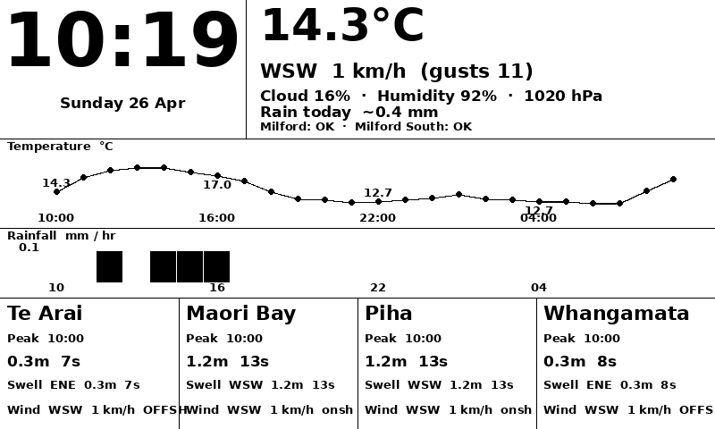

# iot_surf_clock

A Raspberry Pi Zero 2W bedside clock with a Waveshare 7.5" e-ink display. Pulls live weather, surf, and water quality data from a home server and renders it to an 800×480 B&W display.



## What it shows

- **Clock** — large time and date
- **Current conditions** — temperature, wind, gusts, cloud, humidity, pressure, daily rain total, SafeSwim water quality for Milford and Milford South
- **Temperature graph** — 24-hour hourly line with floating labels
- **Rainfall bars** — 24-hour hourly precipitation
- **Surf forecast** — 4 spots showing the best period of the day: wave height, period, swell direction, wind with offshore/onshore indicator

## Architecture

```
Home server (this repo)          Raspberry Pi Zero 2W
┌─────────────────────┐          ┌─────────────────────┐
│  FastAPI + uvicorn  │  Wi-Fi   │  E-ink display      │
│  /weather           │ ──────►  │  Alarm scheduler    │
│  /surf              │          │  Voice / GPIO       │
│  /swim              │          └─────────────────────┘
└─────────────────────┘
```

## Data sources

| Data | Source | Cost |
|------|--------|------|
| Weather (hourly) | [Open-Meteo](https://open-meteo.com) | Free, no key |
| Wave forecasts | MetOcean Solutions API (WW3 global) | Free tier |
| Water quality | [SafeSwim](https://safeswim.org.nz) | Free |

Weather provider is configurable — swap between Open-Meteo and MetOcean in `server/config.py`:
```python
WEATHER_PROVIDER = "openmeteo"  # or "metservice"
```

## Surf spots

Te Arai · Maori Bay · Piha · Whangamata · Takapuna · Tawheranui (first 4 shown on screen)

## Setup

```bash
cd server
cp .env.example .env
# Add your MetOcean API key to .env if using metservice provider
pip install -r requirements.txt
uvicorn server.main:app --port 8000
```

## Emulator

Renders a preview PNG without needing the physical display:

```bash
python -m server.emulator          # polls every 5 min
python -m server.emulator --once   # render once and exit
```

Output: `server/preview.png`

## API endpoints

| Method | Path | Description |
|--------|------|-------------|
| GET | `/weather` | Current conditions + 24h hourly forecast |
| GET | `/surf` | Wave forecast for all configured spots |
| GET | `/swim` | SafeSwim water quality ratings |
| POST | `/weather/refresh` | Bust weather cache |
| POST | `/surf/refresh` | Bust surf cache |
| POST | `/swim/refresh` | Bust swim cache |

## Hardware

- Raspberry Pi Zero 2W
- Waveshare 7.5" e-ink display (800×480, B&W)
- Relay circuit for light control
- Microphone + speaker for voice commands
